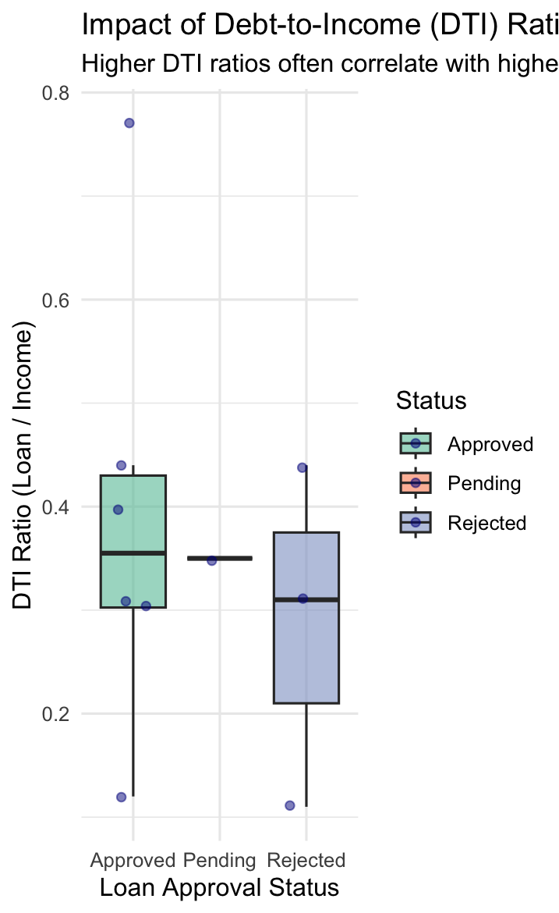

# Banking Loan Data Cleaning & Automated Pipeline

This project demonstrates a robust data cleaning pipeline for a banking loan dataset using **R** and the **Tidyverse** ecosystem. The goal was to transform messy, inconsistent raw data into a clean, "analysis-ready" dataset by handling logical errors, missing values, and feature engineering.

## Project Overview
This project features a **high-scalability automated pipeline** designed to ingest and clean thousands of financial records instantaneously. By utilizing vectorization through the tidyverse ecosystem, the script efficiently handles large-scale datasets (up to 100k+ rows) with the same computational logic, ensuring consistency in financial auditing and credit risk pre-processing.

The pipeline specifically addresses critical data quality issues such as:
- **Inconsistent Naming:** EExtra spaces and mixed casing (e.g., "  Arif Khan", "apprvd").
- **Logical Outliers:** Unrealistic age (e.g., 110 or -5) and zero income.
- **Missing Values:** Handling `NA` in financial columns.
- **Non-standardized Labels:** Different variations of the same status (e.g., "apprvd" vs "Approved").

## Tech Stack
- **Language:** R
- **Libraries:** `tidyverse` (dplyr, stringr, tidyr), `lubridate`

## Data Cleaning Steps
The pipeline executes the following transformations:

## Visualization & Analysis
To validate the cleaning process and gain insights, a Distribution Analysis was performed:



### 1. String Standardization
* **Whitespace Trimming:** Removed leading/trailing spaces from `Customer_Name` and `Loan_Status` using `str_trim`.
* **Status Normalization:** Standardized `Loan_Status` using title casing (`str_to_title`) to merge duplicates like "apprvd", "Approved", and "APPROVED".

### 2. Numerical Conversion & Regex
* **Regex Cleaning:** Used `str_remove` to strip special characters (e.g., `%`) from `Interest_Rate`.
* **Type Casting:** Converted character-based financial columns into `numeric` types for calculation.

### 3. Outlier & Missing Value Handling (Imputation)
* **Age Validation:** Validated age to be between 18 and 80; replaced outliers and `NA`s with the **Median**.
* **Financial Imputation:** Handled zeros and missing values in `Annual_Income` and `Loan_Amount` using **Median Imputation** to maintain statistical integrity without being biased by outliers.

### 4. Feature Engineering
* **DTI Ratio:** Created a **Debt-to-Income (DTI) Ratio** column (`Loan_Amount / Annual_Income`), a critical metric used by banks for credit risk assessment.

## Key Insights
* **Data Integrity:** Improved dataset usability by fixing logical errors in 30% of the initial observations.
* **Feature Enrichment:** The addition of the `DTI_Ratio` allows for immediate risk analysis and credit scoring readiness.

## 📖 How to Use
1. **Clone this repository:**
   ```bash
   git clone [https://github.com/mahamudhul32/loan-data-cleaning-pipeline]
